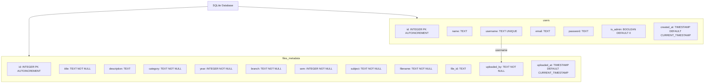
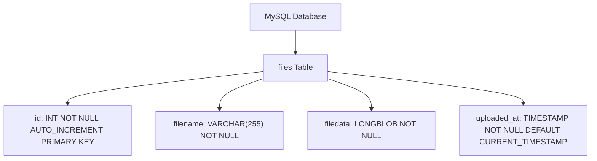
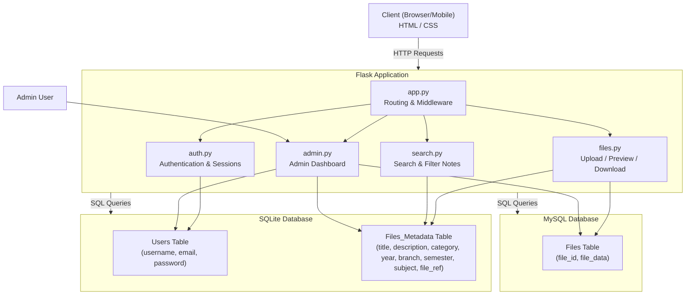

# NotesApp

NotesApp is a modern, mobile-responsive web application designed for students and educators to efficiently upload, manage, preview, and download academic notes. The app provides a structured system for storing files with detailed metadata, enabling fast and convenient search and retrieval of notes across devces.

---

## Table of Contents

- [Features](#features)
- [High-Level Design](#high-level-design-hld)
- [Low-Level Design](#low-level-design-lld)
- [User Functionality](#user-functionality)
- [Authentication & Authorization](#authentication--authorization)
- [Database Design](#database-design)
- [Technology Stack](#technology-stack)
- [NotesApp Architecture Overview](#notesapp-architecture-overview)
- [Project Structure](#project-structure)
- [How to Run](#how-to-run)
- [Future Enhancements](#future-enhancements)

---

## Features

- **Structured Note Metadata:**  
  Each note contains:
  - **Title:** Name of the note
  - **Description:** Brief overview of the content
  - **Category:** Textbook, Notes, Previous Question Paper
  - **Year:** 1st, 2nd, 3rd
  - **Branch:** Computer Science, Electronics & Communication, Mechanical, Civil, Electrical
  - **Semester:** 1 to 6
  - **Subject:** Name of the subject
  - **File:** Main document containing the notes

- **File Preview & Download:**  
  Users can preview files directly within the app and download them for offline access.

- **User Dashboard & Profile:**  
  View personal details (username, email) and manage notes from a unified dashboard.

- **Search & Filter:**  
  Easily search and filter notes by title, branch, year, category, semester, or subject.

- **Admin Features:**
  - View all registered users
  - Delete uploaded files when necessary

- **Secure File Management:**  
  Metadata and file contents are stored in separate databases for optimized access and security.

- **Responsive Design:**  
  Seamless experience across desktops, tablets, and mobile devices.

---

## High-Level Design (HLD)

### Components

**Frontend (Browser / Mobile)**
- HTML & CSS templates for Dashboard, Upload, Profile, File Preview
- Sends HTTP requests to Flask backend (RESTful endpoints)
- Fully mobile-responsive for seamless usage

**Backend (Flask Application)**
- Handles routes, requests, and business logic
- Manages authentication & authorization
- Middleware for access control (user/admin)
- Implements all admin and user functionality
- Interfaces with databases for all operations

**Databases**
- **SQLite**: Stores user info and note metadata for fast lookups
- **MySQL**: Stores actual file contents (binary data)

**File Management**
- Separation of metadata (SQLite) and file contents (MySQL) ensures speed and security

**Admin**
- View users, manage files, delete unwanted uploads

**Users**
- Register, login, upload notes, preview/download files

### Flow

```
User → Frontend → Backend → Database → Backend → Frontend → User
```

---

## Low-Level Design (LLD)

### Login/Register Flow

1. User submits credentials via frontend form
2. Flask backend validates credentials with SQLite
3. On success, a session is created
4. User dashboard is displayed

### Upload Notes Flow

1. User uploads file and enters metadata
2. Metadata is stored in SQLite
3. File binary is stored in MySQL
4. NotesApp update with the new entry

### File Preview/Download Flow

1. User requests a file
2. Flask retrieves metadata from SQLite to locate file reference
3. File is fetched from MySQL
4. Sent to frontend for preview or download

### Admin Flow

1. Admin logs in and is redirected to the admin page
2. Admin can view all users and uploaded files
3. Admin can delete files (removes metadata from SQLite and file from MySQL)

---

## User Functionality

- **Sign Up & Login:**  
  Create an account and securely log in.

- **Upload Notes:**  
  Authenticated users can upload notes with comprehensive metadata.

- **Preview & Download:**  
  Instantly preview uploaded files or download as needed.

- **Dashboard:**  
  Textbooks, Notes and Previous QPs.

- **Profile:**  
  Access your personal account details and activity.

---

## Authentication & Authorization

- Only authenticated users can upload, preview, or download notes.
- Admins have privileged access to manage users and files.
- Middleware ensures restricted access to protected pages.
- Public pages include Login, Register, Admin Login, and a limited Dashboard view.

---

## Database Design

### *SQLite (User Info & Metadata)*
Flowchart



| Table         | Columns                                                       | Purpose                               |
|---------------|--------------------------------------------------------------|---------------------------------------|
| Users         | id, username, email, password_hash, role                     | Stores user credentials and roles     |
| Files_Metadata| id, title, description, category, year, branch, semester, subject, file_reference | Stores note metadata for fast lookups |

--- 
### *MySQL (File Storage)*

Flowchart



| Table | Columns         | Purpose                         |
|-------|----------------|---------------------------------|
| Files | file_id, file_data | Stores actual file contents, referenced by metadata |

---

## Technology Stack

- **Frontend:** HTML, CSS, Jinja
- **Backend:** Flask (Python)
- **Databases:** SQLite (user info & metadata), MySQL (file storage)
---
### NotesApp Architecture Overview


## Project Structure
```

NotesApp/
├── app.py                  # Main Flask application & routing
├── auth.py                 # Authentication blueprint (login, register, logout)
├── admin.py                # Admin blueprint for user/file management
├── db.py                   # SQLite database connection & helpers
├── mysql_db.py             # MySQL connection for file storage
├── templates/              # HTML templates
│   ├── dashboard.html
│   ├── profile.html
│   ├── upload.html
│   ├── auth_file/
│   │   └── register.html
│   │   └── login.html
│   ├── admin/
│   │   └── admin_dashboard.html
│   │   └── admin_login.html
│   │   └── user_data.html
│   └── pages.html
├── static/                 # Static assets (CSS, images)
│   ├── profile.css
│   ├── preview.css
│   ├── dashboard.css
│   ├── upload.css
│   └── img/
├── README.md               # Project documentation
```

---

## How to Run

1. **Clone the repository:**
    ```bash
    git clone https://github.com/Manju200417/NotesApp
    cd NotesApp
    ```

2. **Install dependencies:**
    ```bash
    pip install flask pymysql
    ```

3. **Set up databases:**
    - Configure SQLite for users and metadata.
    - Configure MySQL for file storage.

4. **Run the app:**
    ```bash
    python app.py
    ```

5. **Open your browser:**  
   Visit [http://127.0.0.1:5000](http://127.0.0.1:5000)

---

## Future Enhancements

- Role-based access control for granular permissions
- Full-text search for faster and more accurate results
- Cloud storage integrations (AWS S3, Google Drive)
- Improved UI/UX using frameworks like React or TailwindCSS

---

Enjoy seamless note management with NotesApp!

